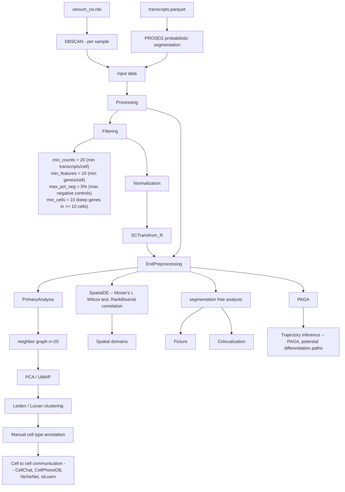

# Xenium_Analysis_SATB2_UMG_2026
Xenium analysis of lower jaws of SATB2 wt and mut. Focused on developmental arest of incisors and impared MC regression in mutants. Analysis in Python.

Planned features:

### DBScan clustering results
- split by sample: saved in 
  - `processed/proseg_out/split/*/transcripts.parquet`
  - `~/PRIMUS/home/sevcoviz/proj_Zimcik/data/processed/xenium_samples/00_C1.rds`

| Groups | x0 (μm) | x1 (μm) | y0 (px) | y1 (px) |
|---|---|---|---|---|
| C1      | 8071.0   | 9320.0   | 14639.0  | 17318.0  |
| C2      | 829.0    | 2267.0   | 15403.0  | 17846.0  |
| C3      | 3088.0   | 4016.0   | 15631.0  | 17924.0  |
| C4      | 6281.0   | 7711.0   | 15334.0  | 18005.0  |
| C5      | 6561.0   | 7474.0   | 19898.0  | 22052.0  |
| C6      | 8018.0   | 9342.0   | 19903.0  | 22099.0  |
| C7      | 1576.0   | 2768.0   | 19846.0  | 22308.0  |
| C8      | 3910.0   | 5330.0   | 20266.0  | 22750.0  |
| unassigned | 2253.0   | 2259.0   | 16479.0  | 16482.0  |

C1-C4 = WT
C5-C8 = MUT